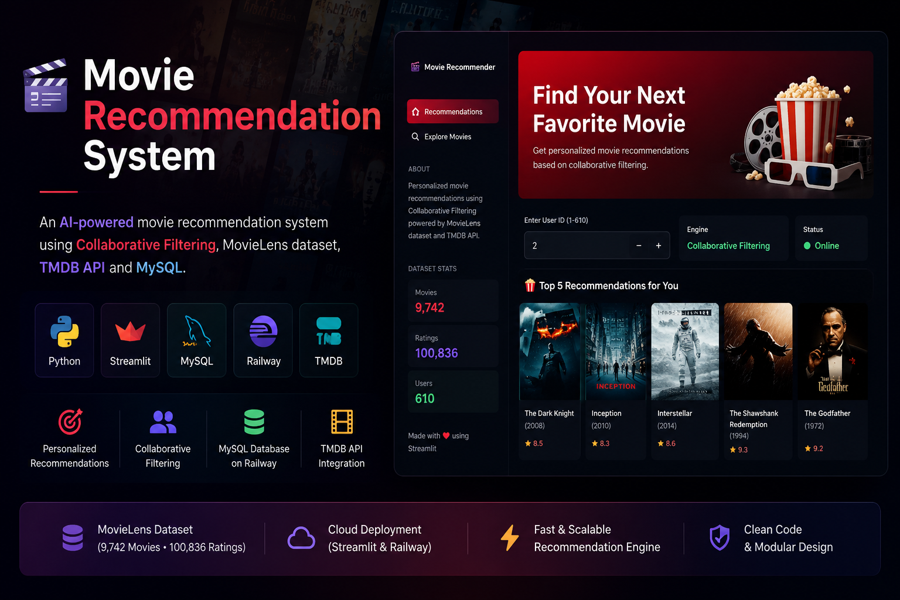
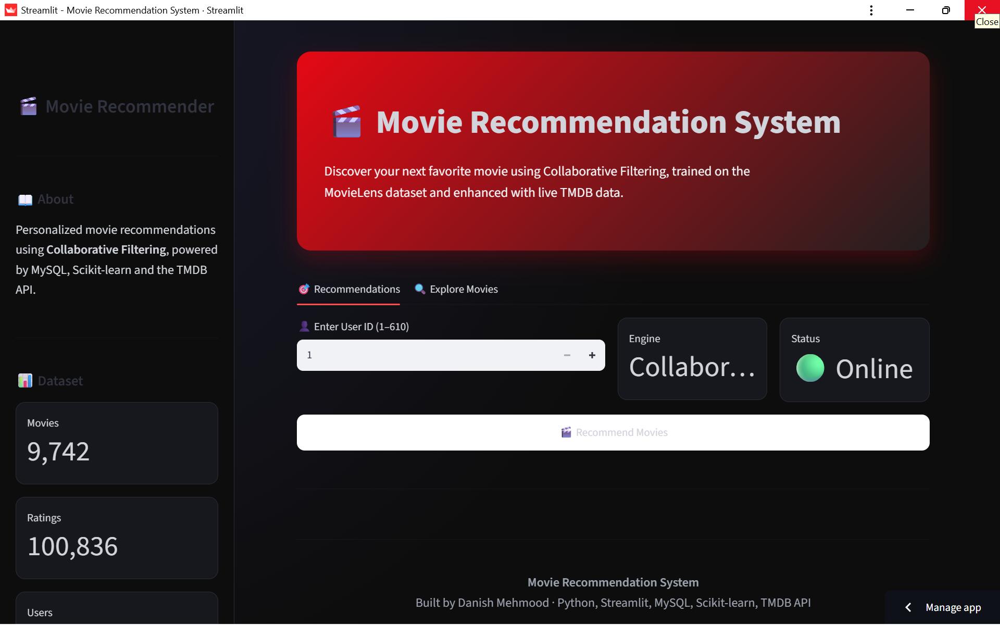

<p align="center">
  
</p>
<div align="center">

# 🎬 Movie Recommendation System

### AI-powered Personalized Movie Recommendation System

Built with **Python • Streamlit • MySQL • Railway • Scikit-learn • TMDB API**

[](https://python.org)
[](https://streamlit.io)
[](https://mysql.com)
[](https://railway.app)
[]()

### 🌐 Live Demo

**https://movie-recommender-danish.streamlit.app**

</div>

---

# 📖 Overview

This project is a **Movie Recommendation System** that provides personalized movie suggestions using **Collaborative Filtering**. The application uses the **MovieLens dataset**, stores data in a **Railway-hosted MySQL database**, and fetches movie information from the **TMDB API**.

The web application is built using **Streamlit** and deployed online for public access.

---

# ✨ Features

- 🎯 Personalized movie recommendations
- 👤 User-based Collaborative Filtering
- 🗄️ MySQL database hosted on Railway
- 🎬 TMDB API integration
- 🌐 Interactive Streamlit interface
- ⚡ Fast recommendation engine
- 📊 MovieLens dataset support
- ☁️ Cloud deployment

---

# 📸 Application Preview



# 🛠 Tech Stack

| Category | Technology |
|-----------|------------|
| Language | Python |
| Frontend | Streamlit |
| Database | MySQL |
| Cloud Database | Railway |
| Machine Learning | Scikit-learn |
| Data Processing | Pandas, NumPy |
| API | TMDB API |
| Version Control | Git & GitHub |

---

# 📂 Project Structure

```text
movie-recommendation-system/
│
├── app.py
├── config.py
├── requirements.txt
├── import_to_railway.py
│
├── data/
│   ├── movies.csv
│   ├── ratings.csv
│   ├── links.csv
│   └── tags.csv
│
├── recommendation/
│   └── engine.py
│
├── database/
│   └── connection.py
│
├── components/
│   └── movie_card.py
│
└── README.md
```

---

# 📊 Dataset

**MovieLens Latest Small Dataset**

| Item | Count |
|------|------:|
| Movies | 9,742 |
| Ratings | 100,836 |
| Users | 610 |

---

# 🚀 Installation

Clone the repository

```bash
git clone https://github.com/danish-mehmood1/movie-recommendation-system.git
```

Move into project

```bash
cd movie-recommendation-system
```

Install dependencies

```bash
pip install -r requirements.txt
```

Run the application

```bash
streamlit run app.py
```

---

# ⚙ Environment Variables

Create a `.env` file

```env
DB_HOST=your_host
DB_PORT=your_port
DB_USER=your_username
DB_PASSWORD=your_password
DB_NAME=your_database

TMDB_API_KEY=your_tmdb_api_key
```

---

# 🌐 Deployment

- Streamlit Cloud
- Railway MySQL

---

# 👨‍💻 Author

## Danish Mehmood

GitHub:
https://github.com/danish-mehmood1

---

<div align="center">

### ⭐ If you like this project, consider giving it a Star.

</div>
